# 📚 Third-Order Letter Approximation & ELIZA Chatbot Project

**Third-Order Letter Approximation & ELIZA Chatbot** project! 
This repository encompasses tasks ranging from text analysis using trigram models to building a classic ELIZA chatbot interface. 

---

# 📜 Table of Contents

- [📚 Third-Order Letter Approximation & ELIZA Chatbot Project](#-third-order-letter-approximation--eliza-chatbot-project)
  - [📋 Tasks Overview](#-tasks-overview)
    - [🔍 Task 1: Third-Order Letter Approximation Model](#-task-1-third-order-letter-approximation-model)
    - [✍️ Task 2: Third-Order Letter Approximation Generation](#️-task-2-third-order-letter-approximation-generation)
    - [📈 Task 3: Analyze Your Model](#-task-3-analyze-your-model)
    - [💾 Task 4: Export Model as JSON File](#-task-4-export-model-as-json-file)
    - [📈 Program Flow Diagram](#-program-flow-diagram)  
  - [🤖 ELIZA Chatbot](#-eliza-chatbot)
    - [🔧 Project Structure](#-project-structure)
    - [✨ Features and Testing Guide](#-features-and-testing-guide)
      - [1. Dynamic Sentiment Analysis](#1-dynamic-sentiment-analysis)
      - [2. Synonym Recognition](#2-synonym-recognition)
      - [3. Interactive Conversations](#3-interactive-conversations)
      - [4. Contextual Memory](#4-contextual-memory)
      - [5. Responsive Date and Time Information](#5-responsive-date-and-time-information)
      - [6. Default Response for Unrecognized Input](#6-default-response-for-unrecognized-input)
      - [7. Reset Chat](#7-reset-chat)
      - [8. Mobile-Friendly Design](#8-mobile-friendly-design)
  - [🚀 Chatbot Workflow Diagram](#-chatbot-workflow-diagram)
  - [🎨 Design Features](#-design-features)
  - [🛠️ Technical Details](#️-technical-details)
  - [📚 References](#-references-)
---

## 📋 Tasks Overview

### 🔍 Task 1: Third-Order Letter Approximation Model

#### **Overview**
Implement a **third-order letter approximation model** that analyzes five plain-text works from Project Gutenberg. This model counts the occurrences of every three-character sequence (trigram) in the cleaned text, providing insights into the frequency of specific letter sequences.

#### **Project Gutenberg Works**
- **Selection Criteria:**
  - Plain Text UTF-8 format.
  - Contains only ASCII characters: letters, spaces, and full stops.
- **File Naming:** `file1`, `file2`, `file3`, `file4`, `file5` for streamlined usage.

#### **Function Descriptions**

1. **`load_and_clean_text(file_paths)`**
   - **Purpose:** Loads multiple text files, removes unwanted characters, and converts all characters to uppercase.
   - **Parameters:**
     - `file_paths` (List[str]): Paths to the Project Gutenberg text files.
   - **Returns:** `str` – A cleaned string ready for trigram analysis.

2. **`generate_trigrams(text)`**
   - **Purpose:** Creates a trigram model by counting every three-character sequence in the cleaned text.
   - **Parameters:**
     - `text` (str): Cleaned text for trigram extraction.
   - **Returns:** `Dict[str, int]` – Dictionary with trigrams as keys and their counts as values.

3. **`display_top_trigrams(trigram_counts, n=100)`**
   - **Purpose:** Displays the top `n` most frequent trigrams.
   - **Parameters:**
     - `trigram_counts` (Dict[str, int]): Trigram frequency dictionary.
     - `n` (int, optional): Number of top trigrams to display. *(Default: 100)*
   - **Displays:** Top `n` trigrams directly in the console.

---

### ✍️ Task 2: Third-Order Letter Approximation Generation

#### **Overview**
Extend the trigram model from Task 1 to generate a 10,000-character-long string. The model predicts the next character based on the frequency of trigrams, following the patterns identified in the cleaned text.

#### **Function Descriptions**

1. **`generate_next_char(trigram_counts, prev_two_chars)`**
   - **Purpose:** Predicts the next character based on the previous two characters using the trigram model.
   - **Parameters:**
     - `trigram_counts` (Dict[str, int]): Trigram frequencies from Task 1.
     - `prev_two_chars` (str): The preceding two characters in the current sequence.
   - **Returns:** `str` – The predicted next character.

2. **`generate_text(trigram_counts, length=10000)`**
   - **Purpose:** Generates a lengthy string by iteratively predicting the next character.
   - **Parameters:**
     - `trigram_counts` (Dict[str, int]): Trigram frequency dictionary.
     - `length` (int, optional): Desired length of the generated text. *(Default: 10,000 characters)*
   - **Returns:** `str` – Generated text of specified length.

---

### 📈 Task 3: Analyze Your Model

#### **Overview**
Assess the quality of the generated text by calculating the percentage of valid English words. This analysis provides insight into the model's ability to produce coherent language sequences.

#### **Function Descriptions**

1. **`load_word_list(file_path)`**
   - **Purpose:** Loads a list of valid English words from a specified file.
   - **Parameters:**
     - `file_path` (str): Path to `words.txt`, containing valid English words.
   - **Returns:** `Set[str]` – Set of uppercase English words.

2. **`calculate_percentage_of_real_words(generated_text, valid_words)`**
   - **Purpose:** Calculates the percentage of valid English words in the generated text.
   - **Parameters:**
     - `generated_text` (str): Text generated by the trigram model.
     - `valid_words` (Set[str]): Set of valid English words.
   - **Returns:** `float` – Percentage of valid English words in the generated text.

---

### 💾 Task 4: Export Model as JSON File

#### **Overview**
Export the trigram model created in Task 1 to a JSON file. This enables future access to the model data or integration with other projects.

#### **Function Description**

- **`export_trigram_model_to_json(trigram_counts, filename='trigram.json')`**
  - **Purpose:** Exports the trigram model to a JSON file.
  - **Parameters:**
    - `trigram_counts` (Dict[str, int]): Trigram model to export.
    - `filename` (str, optional): Name of the JSON file. *(Default: `trigram.json`)*
  - **Result:** Trigram model saved as a JSON file in the specified location.

---

### 📈 Program Flow Diagram

```mermaid
flowchart TD
    A[Start] --> B[📂 Load and Clean Text]
    B --> C[📊 Generate Trigrams]
    C --> D[📜 Display Top Trigrams]
    C --> E[✍️ Generate Text with Trigrams]
    E --> F[🔍 Analyze Generated Text]
    F --> G[📈 Calculate Percentage of Real Words]
    G --> H[📤 Export Trigram Model to JSON]
    H --> I[🏁 End]
```

## 🤖 ELIZA Chatbot

### **Overview**

The **ELIZA Chatbot** is a web-based conversational program inspired by Joseph Weizenbaum's early natural language processing model. It simulates human-like conversations by analyzing user input and responding with dynamic, pre-programmed responses. Designed with a modern interface and interactive capabilities, ELIZA offers an engaging user experience.

---
### GitHub Pages Link:

## 🔧 **Project Structure**

### **File Breakdown**
1. **`index.html`**
   - The main HTML file structuring the chatbot's interface and layout.
2. **`eliza.js`**
   - The JavaScript file containing the chatbot's logic, response patterns, and sentiment detection.
3. **`style.css`**
   - Provides styling for the interface, animations, and overall design.

---

### ✨ **Features and Testing Guide**

### 1. **Dynamic Sentiment Analysis**
ELIZA detects and categorizes the user's emotional state (positive, negative, or neutral) based on input, enhancing response relevance.
- **Test Positive Sentiment:**  
  Type: `I am excited`  
  Expected Response: *"That's great to hear! What has you feeling excited?"*
  
- **Test Negative Sentiment:**  
  Type: `I am feeling stressed`  
  Expected Response: *"Stress can be overwhelming. What's contributing to your stress?"*
  
- **Test Neutral Sentiment:**  
  Type: `I am fine`  
  Expected Response: *"I see. Is there anything you'd like to talk about?"*

---

### 2. **Synonym Recognition**
ELIZA can recognize synonyms of commonly used words or phrases, improving understanding and interaction quality.  
- **Greeting Synonym:**  
  Type: `Hey`  
  Expected Response: *"Hello! How are you feeling today?"*  
- **Emotion Synonym:**  
  Type: `I feel stressed`  
  Expected Response: *"I'm sorry to hear that. Would you like to talk about what's making you feel this way?"*

This is achieved using a robust synonym map that matches variations like "blue" to "sad" or "howdy" to "hello."

---

### 3. **Interactive Conversations**
ELIZA creates meaningful exchanges by analyzing context and patterns in input.  
- **Discuss a Goal:**  
  Type: `I want to learn coding`  
  Expected Response: *"What steps do you think you can take toward achieving 'learn coding'?"*  
- **Ask a Question:**  
  Type: `Why do people feel lonely?`  
  Expected Response: *"What are your thoughts on why people feel lonely?"*

---

### 4. **Contextual Memory**
ELIZA remembers user details, like names and emotions, to make conversations feel more personal.  
- **Provide Name:**  
  Type: `My name is Alex`  
  Expected Response: *"It's a pleasure to meet you, Alex. How has your day been so far?"*  
- **Emotion Tracking:**  
  After typing `I am happy`, type `Why do I feel like this?`  
  Expected Response: *"Let's explore why you feel that way."*

---

### 5. **Responsive Date and Time Information**
ELIZA dynamically fetches and provides the current date or time when asked.  
- **Ask for Time:**  
  Type: `What time is it?`  
  Expected Response: *"The current time is HH:MM AM/PM."*  
- **Ask for Date:**  
  Type: `What's today's date?`  
  Expected Response: *"Today's date is MM/DD/YYYY."*

---

### 6. **Default Response for Unrecognized Input**
When ELIZA doesn't understand the input, it encourages the user to elaborate.  
- **Test Unrecognized Input:**  
  Type: `asdfghjkl`  
  Expected Response: *"Please, tell me more about that."*

---

### 7. **Reset Chat**
Clear the conversation history to start fresh.
- **Reset the Chat:**  
  Click the Reset button in the header.  
  Expected Behavior: The chat history should clear, leaving the interface ready for a new conversation.

---

### 8. **Mobile-Friendly Design**
ELIZA's responsive layout adapts to different screen sizes, offering a seamless experience across devices.

---

### 🚀 Chatbot Workflow Diagram

### 🎨 **Design Features**
- **Glassmorphism UI:**  
  A stylish, modern interface with translucent backgrounds and soft shadows.
- **Typing Indicator:**  
  Simulates ELIZA typing to create a conversational feel.
- **Smooth Animations:**  
  Messages appear with fade-in effects, adding visual appeal.

---

### 🛠️ **Technical Details**
- **Language:** JavaScript
- **Styling:** CSS (Glassmorphism, animations)
- **Core Logic:** Regex pattern matching and dynamic response generation
- **Sentiment Analysis:** Word-based scoring for emotional detection

---

🚀 **Live Demo:** [Try ELIZA Chatbot Now](https://dvlsc000.github.io/EmergingTechnologies)

# 📚 References

The following references were utilized in the development of this project. They include links to resources, tutorials, and documentation that informed the code implementation and design:

## Task 1: Third-Order Letter Approximation Model

1. **N-grams and Trigram Extraction**  
   - [Understanding N-grams in Python](https://stackoverflow.com/questions/17531684/n-grams-in-python-four-five-six-grams)  

2. **Data Cleaning Techniques**  
   - [Removing Non-ASCII Characters in Python](https://stackoverflow.com/questions/20078816/replace-non-ascii-characters-with-a-single-space)  

## Task 2: Trigram-Based Text Generation

3. **Random Selection with Weights**  
   - [Python `random.choices()` Usage](https://docs.python.org/3/library/random.html#random.choices)  

4. **Understanding Text Generation**  
   - [Building Markov Models for Text](https://towardsdatascience.com/how-to-build-a-markov-chain-text-generator-c3b1fed7fad7)  

## Task 3: Model Analysis

5. **Text Cleaning and Tokenization**  
   - [Splitting Strings into Words](https://www.geeksforgeeks.org/python-split-multiple-characters-from-string/)  

6. **Valid Word Check**  
   - [Checking Words Against Dictionary](https://stackoverflow.com/questions/295135/turn-a-string-into-a-valid-variable-name-in-python)  

## Task 4: Exporting Trigram Model

7. **JSON Handling in Python**  
   - [Using `json.dump` for Data Export](https://www.geeksforgeeks.org/json-dump-in-python/)  

## ELIZA Chatbot Development

8. **Regex and String Matching**  
   - [Regex Syntax and Match Patterns](https://developer.mozilla.org/en-US/docs/Web/JavaScript/Reference/Global_Objects/RegExp)  

9. **Dynamic Date and Time Handling**  
   - [JavaScript `Date` Object](https://developer.mozilla.org/en-US/docs/Web/JavaScript/Reference/Global_Objects/Date)  

10. **Chatbot Design and User Interaction**  
    - [Building Conversational Interfaces](https://developer.mozilla.org/en-US/docs/Learn/JavaScript/Client-side_web_APIs/Client-side_storage)  

## Web Application UI/UX

11. **Responsive Design with Flexbox**  
    - [Flexbox Guide](https://css-tricks.com/snippets/css/a-guide-to-flexbox/)  

12. **Glassmorphism UI Inspiration**  
    - [Glassmorphism Explained](https://uxdesign.cc/glassmorphism-in-user-interfaces-1f39bb1308c9)  

13. **Animation**  
    - [CSS Fade-In Animations](https://stackoverflow.com/questions/71758805/i-wish-this-animation-would-stay-on-the-page-for-a-few-seconds-and-then-fade-awa)  

---

